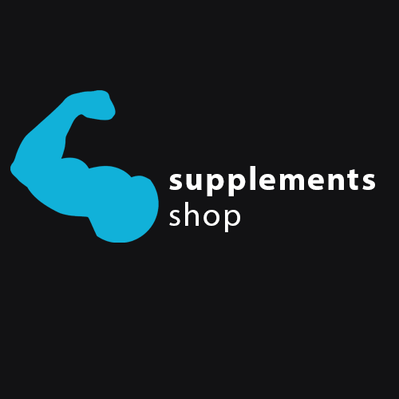
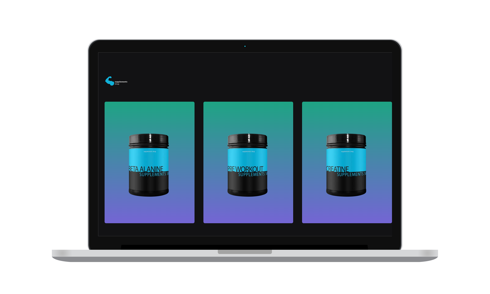
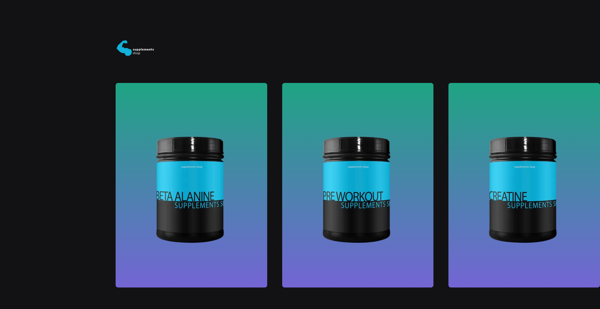
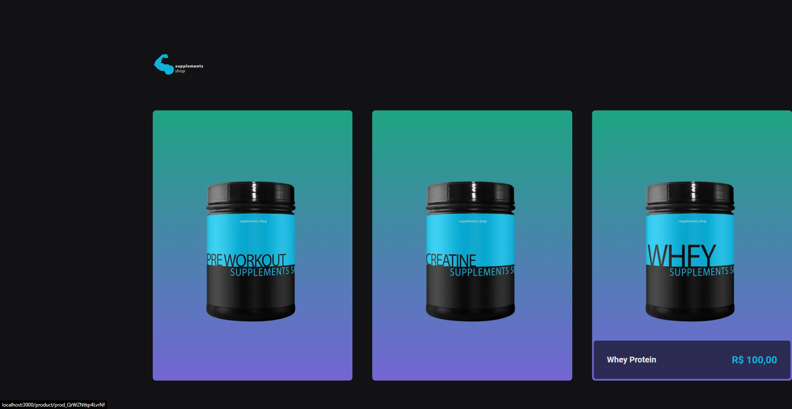
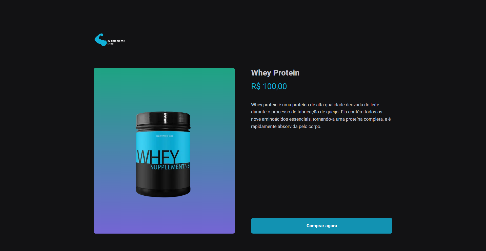
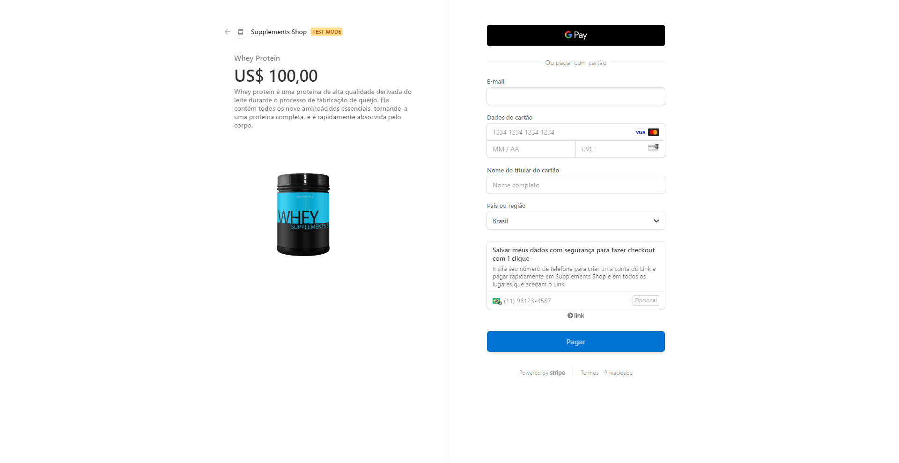
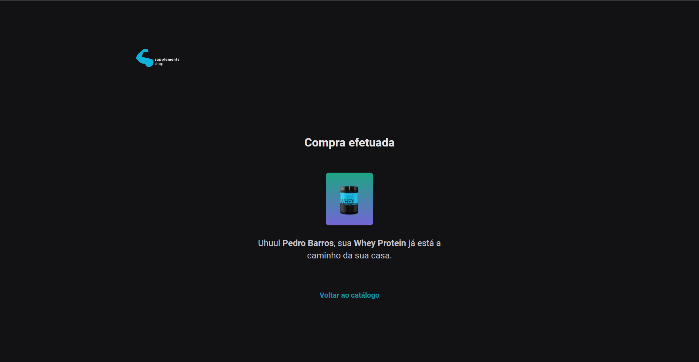

<h1 align="center">
  
</h1>

  
  

 

  

Supplement e-commerce, buy quickly online using the stripe gateway.

 

  
  
  
  
  

## 🔺 Demo

### [Live Demo, click here]()

## 📦 Tech Stack

- Next
- Typescript
- Stripe

[check in package.json](/package.json)

## 🔩 Installation

To install and run the project locally, follow these steps:

1. Install [**Yarn**](https://yarnpkg.com/) on your computer
1. Clone the repository `git clone https://github.com/jhonbergmann/supplements-shop.git`
1. Navigate to the project directory: `cd supplements-shop`
1. Install the dependencies: `yarn install`

## ⚙️ Usage

1. Start the development server: `yarn dev`
1. Now access the following url in your browser: `http://localhost:3000`

#### ⚙️ Stripe

https://docs.stripe.com/testing

here...

## 📝 License

[MIT © Jhonatan Bergmann](https://github.com/jhonbergmann/supplements-shop/blob/main/LICENSE)
